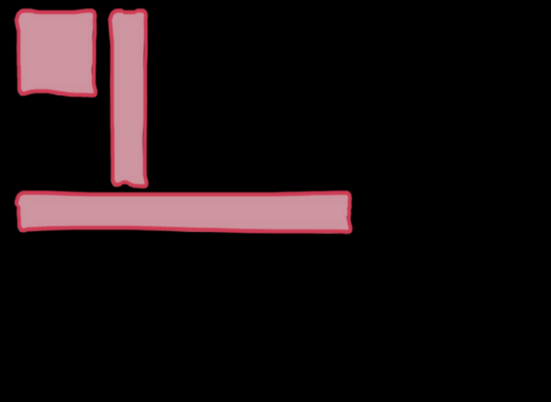

NineSlice

Author: GustavoFurtad2 (github.com/GustavoFurtad2)

# What is NineSlice?

NineSlices are interfaces generated from 9 pieces of images that allow you to design an interface of any size

# Preview




# How to start?
  In the top of your code can you import like this:
```js
import {NineSlice} from "./nineslicejs"
```
  And create a nineslice object in this way:
  ```js
let images = [ // you must provide the 9 images
    new Image("assets/1.png"),
    new Image("assets/2.png"),
    new Image("assets/3.png"),
    new Image("assets/4.png"),
    new Image("assets/5.png"),
    new Image("assets/6.png"),
    new Image("assets/7.png"),
    new Image("assets/8.png"),
    new Image("assets/9.png")
]

let ui = new NineSlice(images)
  ```
then you just need to draw
```js
while (true) {
    Screen.clear()

    ui.draw(10, 10, 100, 100)
    ui.draw(120, 10, 50, 200)
    ui.draw(10, 210, 400, 50)

    Screen.flip()
}
```